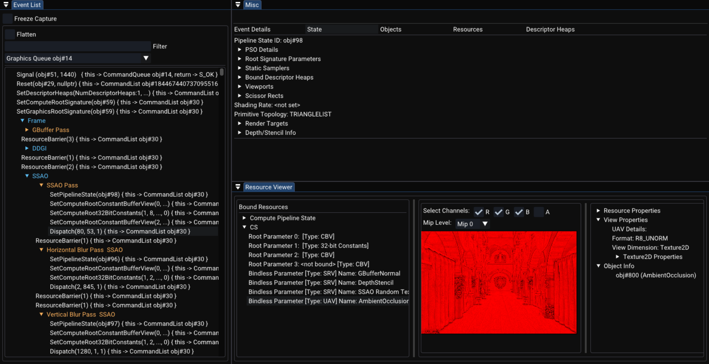

  

Real-time D3D12 frame analysis tool for capturing, inspecting, and debugging graphics commands, pipeline state and resources.

Unlike traditional capture-based debuggers, **Vista** enables live introspection, making it useful for catching transient or synchronization-related issues, 
quickly identifying problematic command patterns, or generally observing GPU behavior frame-by-frame without the need to stop and save a capture.
> **Note**: Vista is still in **very early development**. Crashes or incomplete features should be expected.

## Features
- **Live D3D12 Frame Inspection**  
  - Capture commands in real-time without halting the target application 
  - Freeze the capture at any time to allow stable inspection
    
- **Event List**  
  - View all captured commands in a scrollable event list
  - Apply filters to quickly locate relevant events  
  - Commands are structured hierarchically by intercepting `BeginEvent`/`EndEvent` to show execution flow

- **Detailed Command Inspection**  
  - View detailed metadata for each command
  - Inspect parameters, associated GPU state, and context

- **Pipeline State & Resource Introspection**  
  - View current pipeline state, descriptor heaps, and bound resources for selected command 

- **Object & Resource Tracking**  
  - Browse all created D3D12 objects

- **Resource Viewer**  
  - Preview bound resources such as `Buffer, Texture2D` at the selected command
  - Resource information and descriptor view metadata shown side-by-side
  - Buffer format window for specifying custom buffer formats
  - Channel and mip selection for `Texture2D` preview

## Current State

## Current Limitations & Future Plans
- Bindless resources are not yet supported
- `Buffer` and `Texture2D` resources are previewable  
  - Support for other resources such as `Texture1D, Texture2DArray`, etc., is planned
- UI/UX improvements 
- Live inspection means state can be volatile  
  - For example, the **selected command may become unselected or incorrectly reselected** between frames if the command list changes too much, Vista uses heuristics to re-identify the selected command, which may fail if the structure diverges significantly

## How It Works
Vista consists of two main components:
### 1. `Vista`  
A DLL to be injected into the target D3D12 application to hook and monitor rendering commands, state, and resources. 
Uses [DirectHook](https://github.com/mateeeeeee/DirectHook) for D3D12 hooking.
### 2. `QVista`  
A simple Qt app that launches the target process and injects Vista DLL

## License
This project is licensed under the GNU Lesser General Public License v3.0. See the LICENSE file for details.
Vista uses Qt, which is licensed under LGPLv3. Qt source code is available at https://code.qt.io/.
